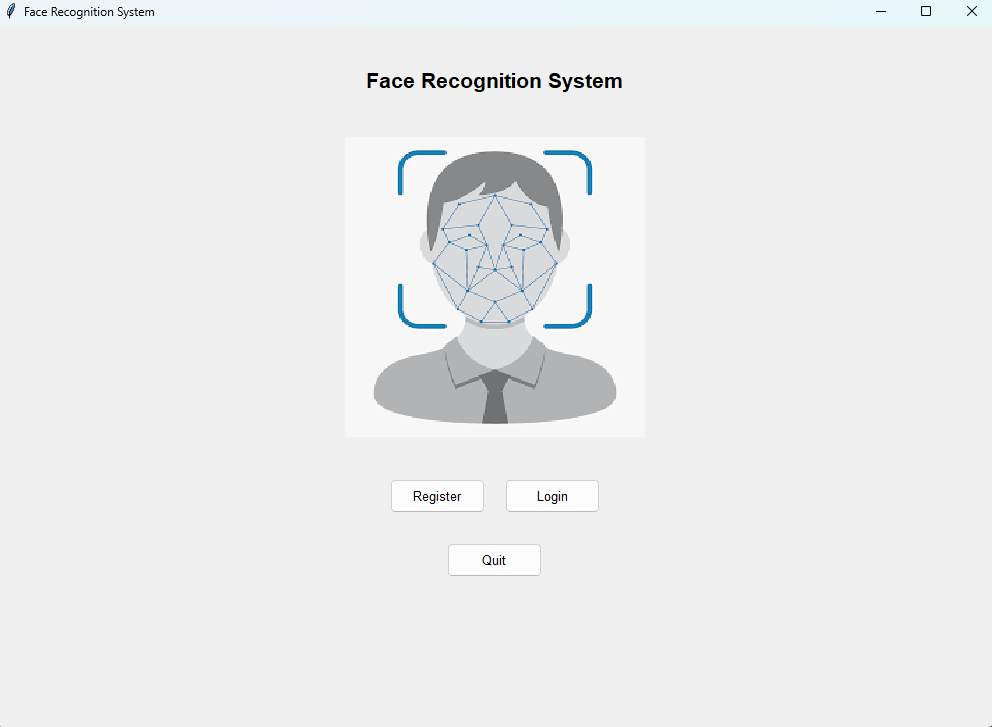
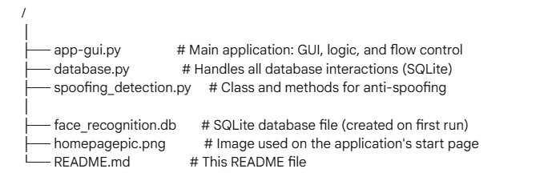

# Enhancing Biometric Authentication: Leveraging AI with Real-Time Facial Recognition and Spoofing Prevention
## Project Overview
This project presents a comprehensive biometric security system that uses real-time facial recognition for user authentication. It is fortified with a robust, multi-modal spoofing attack detection mechanism to prevent unauthorized access via presentation attacks (e.g., using photos or videos). The system features a secure database backend and a full-featured administrator panel for user management and security auditing, all wrapped in an intuitive graphical user interface (GUI).

**Homepage:**  
  

**Registering Page:**  
  

**Face Capture Page:**  

**Train Model Page:**  

**Login Page:**  
  

**Face Recognition Page:**  
 
  
**Application Demo:**  

**Link to full demo on Onedrive share:** https://1drv.ms/v/c/6f8cc5e3f75fcf01/EeTU98Y7vK5Gmb1W44UmmKoBZmZwVCGS9iWPZHbZJtD6Tg?e=vRegLr 

## 📋 Results
This system successfully implements a complete authentication pipeline:
* Secure Registration & Login: Users can create accounts with a username and password, which are stored securely (passwords are hashed).
* Biometric Enrollment: Each user's facial data is captured through a guided process to create a personalized dataset.
* AI-Powered Training: A unique Local Binary Patterns Histograms (LBPH) face recognizer is trained for each user, creating a personalized biometric model.
* Real-Time Recognition: During login, the system performs real-time facial verification against the user's trained model.
* Advanced Spoofing Prevention: Before granting access, the system analyzes the camera feed for signs of a presentation attack. It uses a combination of reflection analysis, texture analysis (Laplacian variance), and face size checks to determine if the face presented is live or a spoof.
* Admin Oversight: An admin panel provides a dashboard to manage users, view detailed login history (including spoofing attempts), and monitor overall system statistics.

## 📦 Packages and Tools
This project relies on the following core technologies and Python packages:
* Python 3.x
* OpenCV (opencv-contrib-python): For all computer vision tasks, including face detection, LBPH face recognition, and real-time video processing.
* Tkinter: For building the graphical user interface.
* Pillow (PIL): For image processing and integration with Tkinter.
* NumPy: For efficient numerical operations on image data.
* SQLite 3: For robust, file-based database management.

## 📁 Project structure
The project is organized into several key files that separate concerns like the GUI, database logic, and AI models.  
  

## Files explanation
app-gui.py
This is the main executable file and the heart of the application.
* GUI Management: It builds the tkinter GUI, including all pages (Start, Login, Register, Capture, Train, Recognize) and the Admin Panel.
* Application Flow: Manages the state and transitions between different pages, guiding the user from registration to final recognition.
* Integration: It orchestrates the entire process by creating instances of FaceRecognitionDB and SpoofingDetector and calling their methods at the appropriate times (e.g., verifying a user, checking for spoofing, saving a face image).
database.py
This module acts as a data abstraction layer, handling all communication with the SQLite database.
* Class FaceRecognitionDB: Encapsulates all database operations.
* Responsibilities:
   * Manages tables for users, face_images, classifiers, and login_history.
   * Handles user creation, credential verification (with password hashing using SHA256), and deletion.
   * Stores and retrieves raw face images (BLOB), trained classifier models, and login attempt logs.
   * Provides methods to fetch system-wide statistics for the admin panel.
   * Automatically creates a default admin account on first run.
spoofing_detection.py
This module is dedicated to presentation attack detection.
* Class SpoofingDetector: Implements a multi-modal check to differentiate between a live face and a fake one.
* Detection Methods:
   1. Reflection Analysis: Detects unnaturally bright spots on the frame, which often indicate glare from a screen or a laminated photo.
   2. Texture Analysis: Measures image sharpness using the variance of the Laplacian. A low score suggests a lack of texture, typical of a printed photo.
   3. Face Area Check: Flags faces that are unusually small, which can occur when a photo is held far from the camera.

## 🚀 Step-by-Step Usage
1. Setup
Clone the repository:
git clone <your-repository-url>
cd <repository-folder>

Install the required packages:
Install the packages in requirements.txt

2. Run the Application
Execute the main GUI file from your terminal:
python app-gui.py

3. User Registration
	1. On the start page, click Register.
	2. Enter a unique username and a strong password, then click Register.
	3. You will be automatically taken to the Face Capture page.
	4. Position your face in the center of the camera view and click Start Capture. The system will capture 300 images of your face.
	5. After capture, the Train Model button will be enabled. Click it to go to the training page.
	6. Click Train Now to build your personalized facial recognition model.

4. User Login
	1. From the start page, click Login.
	2. Enter your username and password.
	3. The system will activate the camera. Hold still and look directly at the camera.
	4. It will first verify that your face is live (anti-spoofing) and then match it against your trained model.
	5. Upon successful verification, you will be logged in.

5. Admin Panel
	1. To access the admin panel, first log in with the default admin credentials:
   		* Username: admin
  	 	* Password: admin123
	2. After logging in, you'll be on the recognition page. Return to the start page by clicking "Back".
	3. On the start page, an Admin Panel button will now be visible. Click it.
	4. In the panel, you can:
  		* Manage Users: View all users, delete users, and grant/revoke admin privileges.
  		* View Login History: See a detailed log of all login attempts.
