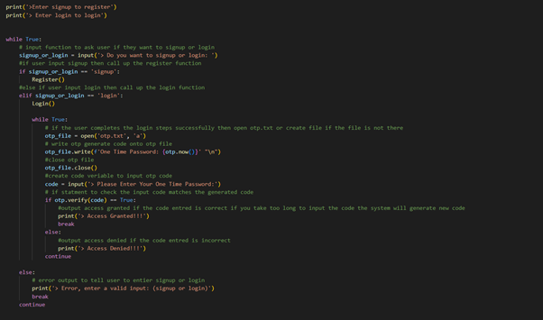

# Online Shopping System using OTP and password validator

## Online shopping system that allows users to register and login with two security techniques by ensuring that passwords meet certain complexity requirements, and generates a one-time password for authentication

## Introduction:

In relation to the previous assignment, this project aims to demonstrate solutions for cyber security issues that may arise for an online shopping system. As previously mentioned in the Online Shopping System proposal, one of the main security concerns outlined in the STRIDE threat modelling framework was Spoofing. Spoofing refers to the fraudulent practice of impersonating another entity, individual, or system with the intention of deceiving or misleading a user; Cybercriminals may attempt to gain access to sensitive information or carry out unauthorized actions by using false credentials to impersonate legitimate users (Shostack, 2014, p. 64). 
To mitigate this risk, this project implements two-factor authentication (2FA) using Python. The two methods demonstrated in this project are One Time Password (OTP) and Password Complexity Requirments. 
 

## One Time Password:

To overcome the main issues associated with relying on passwords and to ensure authentication and authorisation, the method of two-factor authentication was developed. This approach involves using two distinct components, commonly referred to as factors, namely the login credentials such as the username and password as well as a One Time Password, a dynamic code that can be obtained by the user usually via SMS (Andrews, 2018). Thus, once the user logs into the system using their username and password, they are sent a One Time Password to authenticate them and authorise them access to their account. OTP operates on the principle that every user's account is connected to a mobile phone and ideally only the user should receive SMS messages sent to the phone number associated with their account (Mulliner et al., 2013). 

Therefore, as devices are physically owned by individuals and associated with a specific account, this makes OTP an integral component of a multi-factor authentication (Reese et al., 2019). However, as studies have highlighted there several criticisms of OTP. This includes an attacker acquiring the OTP through physical access to the phone, a SIM swap attack, or wireless interception (Mulliner et al., 2013). In all these instances a cybercriminal could gain access to the OTP and authorisation into the user’s account. Thus, it is important to implement multiple layers of security measures as OTP can have limitations. 

This project uses PyOTP, a Python library for generating and authenticating one-time passwords. It is capable of implementing two-factor (2FA) or multi-factor (MFA) authentication methods in web applications and other systems that need users to log in. A time-based restriction element is also utilised to ensure the OTP times out if it is not used promptly. 
 

## Password validator:

Another Python library used in this project is the Password Validator. It is capable of validating passwords based on meting a set criteria. As described by Wang and Wang (2015), password composition policies are a set of guidelines that organisations use to help users create strong passwords. These policies outline the specifications for creating an acceptable password, including the minimum character length, for example, including at least eight characters, symbols, numbers, uppercase and lowercase letters). Password validation aims to address the issue of weak passwords and ensure users create stronger passwords. 
The purpose of strict password composition policies is to improve password security; however, they cannot guarantee that user-generated passwords will be difficult to crack. Users may still create passwords that meet the password composition policy requirements but are predictable, such as by using common words and dates or patterns (Guo et al., 2019). Therefore, to overcome these vulnerabilities, it is crucial to implement multiple layers of security measures.
 

 
## Code Decomposition:

### Installing libraries:
Libraries such as pyotp and password_validator need to be installed for the application to run.

### Importing libraries:
This program uses PyOTP and password_validator libraries to generate OTP codes and validate password complexity.

### Creating variables for imported libraries:
The PyOTP library uses a OTP variable to generate random OTP codes, while the Password Validator library uses a complexity variable to define the password complexity requirements.

### Registration function and Password validation definiation:
The Register function in the program prompts the user to input a username and password, validates the password complexity requirements using the password_validator library, and stores the username and password in pass.txt if the password meets the requirements.

### Login function:
The Login function in the program prompts the user to input their username and password, compares it to the information stored in a pass.txt, and grants access if the information matches or denies access if it does not match.

 

### Main program body and OTP definition:
The program asks the user to choose between signing up for a new account or logging into an existing account by prompting them to enter either "signup" or "login", it also contains OTP verification to ensure secure user authentication during login.

## program video demonstration 

## usage

1. The user launches the application and is presented with the option to either register or login.

2. If the user is a new user, they select the register option and enter their desired username and password, ensuring that the password meets certain complexity requirements.

3. If the registration is successful, the user is informed and prompted to log in with their new credentials.

4. The user selects the login option and enters their username and password.

5. The system validates the username and password, and if they are correct, welcomes the user to the online shopping system.

6. The user is then prompted to enter a one-time password that is generated by the system.

7. The system validates the one-time password and if it matches, grants the user access to the shopping system.

8. If the user enters an incorrect one-time password, the system denies access and prompts the user to enter a new one.

## References: 

* Andrews, N., 2018. Can I Get Your Digits: Illegal Acquisition of Wireless Phone Numbers for Sim-Swap Attacks and Wireless Provider Liability. Nw. J. Tech. & Intell. Prop., 16, 79.
* Guo, Y., Zhang, Z. and Guo, Y., 2019. Optiwords: A new password policy for creating memorable and strong passwords. Computers & Security, 85, pp.423-435.
* Mulliner, C., Borgaonkar, R., Stewin, P. and Seifert, J.P., 2013. SMS-Based One-Time Passwords: Attacks and Defense: (Short Paper). In Detection of Intrusions and Malware, and Vulnerability Assessment: 10th International Conference, DIMVA 2013, Berlin, Germany, July 18-19, 2013. Proceedings 10 (pp. 150-159). Springer Berlin Heidelberg.
* Reese, K., Smith, T., Dutson, J., Armknecht, J., Cameron, J. and Seamons, K., 2019, July. A usability study of five two-factor authentication methods. In Proceedings of the Fifteenth Symposium on Usable Privacy and Security.
* Shostack, A., 2014. Threat modeling: Designing for security. John Wiley & Sons.
* Wang, D. and Wang, P., 2015. The emperor’s new password creation policies: An evaluation of leading web services and the effect of role in resisting against online guessing. In Computer Security--ESORICS 2015: 20th European Symposium on Research in Computer Security, Vienna, Austria, September 21-25, 2015, Proceedings, Part II 20 (pp. 456-477). Springer International Publishing.

